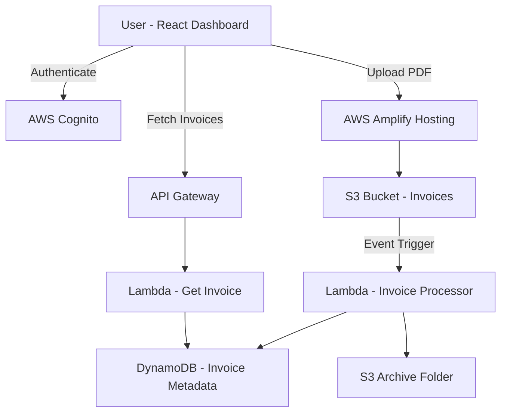

# Smart Accountant
## An AI-powered, serverless invoice automation platform

---

## 📌 Overview

Smart Accountant is a production-grade, full-stack serverless application that automates invoice ingestion and data extraction for accounting workflows.

The system removes the need for manual data entry by using an event-driven architecture on AWS. It is designed with scalability, security, and operational simplicity as core principles and follows real-world cloud engineering best practices.

---

## 🎯 Problem Statement

Traditional accounting workflows rely on manual invoice uploads, repetitive data entry, and human validation of invoice details such as vendor names, dates, and totals.

These workflows are:
- Time-consuming
- Error-prone
- Difficult to scale

Smart Accountant solves this by automating the complete invoice lifecycle from upload to structured data storage and retrieval.

---

## 🧠 Architecture Overview

Smart Accountant uses an Event-Driven Serverless Architecture built entirely on managed AWS services.

### End-to-End Flow

1. User authenticates via Amazon Cognito
2. User uploads a PDF invoice through the React dashboard
3. The file is uploaded directly to an Amazon S3 bucket
4. The S3 upload event triggers a Python Lambda function
5. Lambda parses the PDF and extracts key invoice metadata
6. Metadata is stored in Amazon DynamoDB
7. The original invoice file is archived in S3
8. The dashboard retrieves processed data via API Gateway and Lambda

---

## 🗺️ Architecture Diagram

⸻

🛠️ Technology Stack

Frontend
	•	React (Vite)
	•	Tailwind CSS
	•	AWS Amplify (Hosting & CI/CD)

Authentication
	•	Amazon Cognito

Backend Compute
	•	AWS Lambda (Python 3.9)

Infrastructure as Code
	•	AWS SAM (Serverless Application Model)

Storage
	•	Amazon S3 (Raw uploads and archived invoices)

Database
	•	Amazon DynamoDB (NoSQL)

API Layer
	•	Amazon API Gateway (REST)

⸻

📂 Repository Structure

.
├── backend/
│   ├── template.yaml              # AWS SAM infrastructure definition
│   └── functions/
│       ├── processor/             # S3-triggered Lambda
│       │   └── app.py
│       └── get_invoice/           # API Gateway Lambda
│           └── app.py
│
├── src/
│   ├── Dashboard.jsx              # React dashboard
│   ├── main.jsx
│   └── api/
│
├── amplify/
│   └── backend/                   # Amplify deployment configuration
│
└── README.md

⸻

🚀 Installation & Setup

Prerequisites
	•	AWS Account
	•	AWS CLI (configured)
	•	AWS SAM CLI
	•	Amplify CLI
	•	Node.js 18+
	•	Python 3.9

⸻

🔧 Backend Setup (AWS SAM)

cd backend
sam build
sam deploy --guided

This deployment provisions:
	•	AWS Lambda functions
	•	Amazon S3 buckets
	•	Amazon DynamoDB tables
	•	API Gateway endpoints
	•	IAM roles and permissions

⸻

🎨 Frontend Setup (React + Amplify)

npm install
npm run dev

Deployment to AWS:

amplify init
amplify publish

AWS Amplify handles hosting, CI/CD pipelines, and environment configuration.

⸻

🔐 Security Model
	•	Authentication and authorization handled by Amazon Cognito
	•	IAM roles follow least-privilege access principles
	•	Direct S3 uploads prevent backend exposure
	•	Invoice files are private and not publicly accessible
	•	All API endpoints require authenticated requests

⸻

🧭 Future Roadmap

🤖 GenAI Integration
	•	Natural language interaction with invoices
	•	Powered by AWS Bedrock (Claude 3)
	•	Query invoices using conversational prompts

🕵️ Fraud Detection
	•	Automatic detection of duplicate invoices
	•	Vendor and invoice number anomaly detection

🔔 Smart Alerts
	•	SNS notifications for high-value invoices
	•	Alerts for suspicious billing behavior

⸻

📜 License

MIT License

⸻

🧑‍💻 Author Notes

This project is built with a senior-engineer mindset:
	•	Event-driven serverless design
	•	Infrastructure defined as code
	•	Clean separation of concerns
	•	Cloud-native scalability and security

Smart Accountant is intended as a real-world foundation for modern accounting automation platforms.

